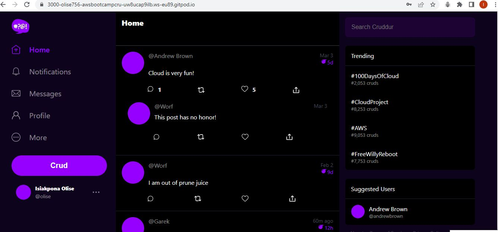
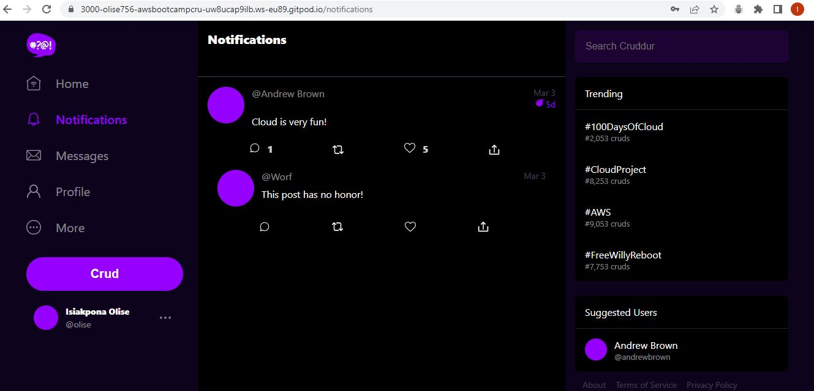
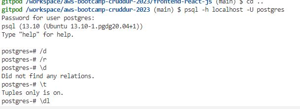

# Week 1 — App Containerization
# Required Homework
## Front-end and Backend Containarization
Created docker-files for the frontend and backend apps.

Intiated the docker files and codes to display the Home and Norifications pages.

## Postgres And DynamoDB
With the help of my docker compose file I was albe to add commands to create and run DynamDB and Postgress on my application
I connected PostgreSql to the database explorer server and confirmed PostgteSQl was running with the command:

**psql -h localhost -U postgres**

# Homework Challenges

Incoming, Kindly stay tuned.

