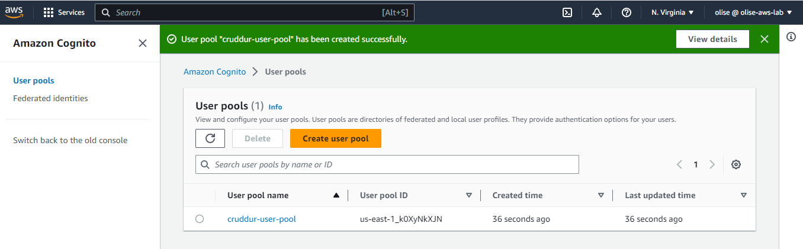

# Week 3 — Decentralized Authentication

Authentication is establishing that you are who you say you are.

## Creating Cognito user pool
- Log in to your aws cognito console
- go to **Users pool**
- by default 'Cognito user pool' is is selected.
- check 'User name' and 'Email' 
- under 'User name requirements' select 'Allow users to sign in with a preferred user name'
- click 'Next'
- select 'No MFA' and leave the rest at default
- click 'Next'
- select 'name' and preffered_username under the 'Additional required attributes' dropdown under 'Required attributes' and leave the rest at default
- click 'Next' 
- select an email with cognito
- Click 'Next' 
- Give your user pool and App client a name  
- Leave the other settings at default and click to create.



#Install AWS Amplify
To install amplify, navigate into the frontend directory and put this in
```
npm i aws-amplify --save
```

import { Amplify } from 'aws-amplify';

Amplify.configure({
  "AWS_PROJECT_REGION": process.env.REACT_APP_AWS_PROJECT_REGION,
  "aws_cognito_region": process.env.REACT_APP_AWS_COGNITO_REGION,
  "aws_user_pools_id": process.env.REACT_APP_AWS_USER_POOLS_ID,
  "aws_user_pools_web_client_id": process.env.REACT_APP_CLIENT_ID,
  "oauth": {},
  Auth: {
    // We are not using an Identity Pool
    // identityPoolId: process.env.REACT_APP_IDENTITY_POOL_ID, // REQUIRED - Amazon Cognito Identity Pool ID
    region: process.env.REACT_APP_AWS_PROJECT_REGION,           // REQUIRED - Amazon Cognito Region
    userPoolId: process.env.REACT_APP_AWS_USER_POOLS_ID,         // OPTIONAL - Amazon Cognito User Pool ID
    userPoolWebClientId: process.env.REACT_APP_CLIENT_ID,   // OPTIONAL - Amazon Cognito Web Client ID (26-char alphanumeric string)
  }
});
