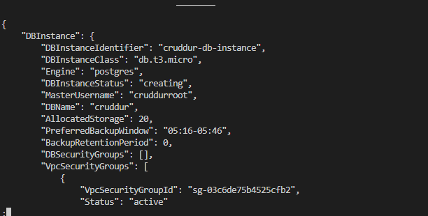
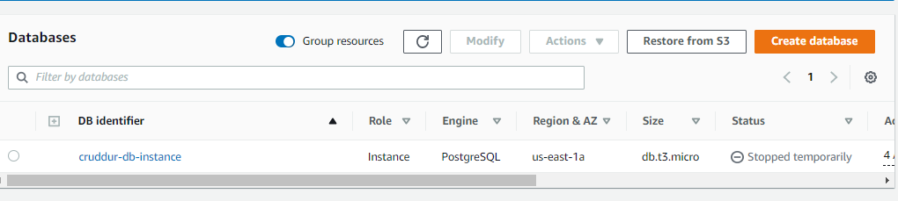

# Week 4 — Postgres and RDS

I learned about RDS- PSQL database this week. I provisioned the RDS on my Aws console programatically via CLI with the commands:

```
aws rds create-db-instance \
  --db-instance-identifier cruddur-db-instance \
  --db-instance-class db.t3.micro \
  --engine postgres \
  --engine-version  14.6 \
  --master-username root \
  --master-user-password huEE33z2Qvl383 \
  --allocated-storage 20 \
  --region us-east-1 \
  --availability-zone us-east-1a \
  --backup-retention-period 0 \
  --port 5432 \
  --no-multi-az \
  --db-name cruddur \
  --storage-type gp2 \
  --publicly-accessible \
  --storage-encrypted \
  --enable-performance-insights \
  --performance-insights-retention-period 7 \
  --no-deletion-protection
```



#Postgres
To be able to connect to the posgres database database, we had to install a driver for postgres by inserting this command in **requirements.txt** file 
```
psycopg[binary]
psycopg[pool]
```
After that run the command:
```
pip install -r requirements.txt
```
#We need to set the env var for our backend-flask application:#
```
  backend-flask:
    environment:
      CONNECTION_URL: "${PROD_CONNECTION_URL}"
```
**to connect to PROD environment, navigate to the backend-flask and input./bin/db-connect prod**


# Setup Cognito post confirmation lambda
Create the handler function
Create lambda in same vpc as rds instance Python 3.8
Add a layer for psycopg2 with one of the below methods for development or production
ENV variables needed for the lambda environment.
```
PG_HOSTNAME='cruddur-db-instance.czz1cuvepklc.us-east-1.rds.amazonaws.com'
PG_DATABASE='cruddur'
PG_USERNAME='root'
PG_PASSWORD='huEE33z2Qvl383'
The function
```
```
import json
import psycopg2
import os

def lambda_handler(event, context):
    user = event['request']['userAttributes']
    print('userAttributes')
    print(user)

    user_display_name  = user['name']
    user_email         = user['email']
    user_handle        = user['preferred_username']
    user_cognito_id    = user['sub']
    try:
      print('entered-try')
      sql = f"""
         INSERT INTO public.users (
          display_name, 
          email,
          handle, 
          cognito_user_id
          ) 
        VALUES(%s,%s,%s,%s)
      """
      print('SQL Statement ----')
      print(sql)
      conn = psycopg2.connect(os.getenv('CONNECTION_URL'))
      cur = conn.cursor()
      params = [
        user_display_name,
        user_email,
        user_handle,
        user_cognito_id
      ]
      cur.execute(sql,tuple(params))
      conn.commit() 

    except (Exception, psycopg2.DatabaseError) as error:
      print(error)
    finally:
      if conn is not None:
          cur.close()
          conn.close()
          print('Database connection closed.')
    return event
```
# SQL
### `./bin/db-connect` to connect to the psql 
```
#! /usr/bin/bash
if [ "$1" = "prod" ]; then
  echo "Running in production mode"
  URL=$PROD_CONNECTION_URL
else
  URL=$CONNECTION_URL
fi

psql $URL
```

### `./bin/db-create` to create a new table 'cruddur'
```
#!  /usr/bin/bash

CYAN='\033[1;36m'
NO_COLOR='\033[0m'
LABEL="db-create"
printf "${CYAN}== ${LABEL}${NO_COLOR}\n"

NO_DB_CONNECTION_URL=$(sed 's/\/cruddur//g' <<< "$CONNECTION_URL")
psql $NO_DB_CONNECTION_URL -c "create database cruddur;"
```

### `./bin/db-drop` to drop if the table is existing
```
#!  /usr/bin/bash

CYAN='\033[1;36m'
NO_COLOR='\033[0m'
LABEL="db-drop"
printf "${CYAN}== ${LABEL}${NO_COLOR}\n"

NO_DB_CONNECTION_URL=$(sed 's/\/cruddur//g' <<< "$CONNECTION_URL")
psql $NO_DB_CONNECTION_URL -c "drop database cruddur;"
```

### `./bin/db-schema-load` to load the schema , which means to give the contents and set its' constraints.
```
#! /usr/bin/bash

CYAN='\033[1;36m'
NO_COLOR='\033[0m'
LABEL="db-schema-load"
printf "${CYAN}== ${LABEL}${NO_COLOR}\n"

schema_path="$(realpath .)/db/schema.sql"
echo $schema_path

if [ "$1" = "prod" ]; then
  echo "Running in production mode"
  URL=$PROD_CONNECTION_URL
else
  URL=$CONNECTION_URL
fi

psql $URL cruddur < $schema_path
```

### `./bin/db-seed` to insert the data into schema loaded
```
#! /usr/bin/bash

CYAN='\033[1;36m'
NO_COLOR='\033[0m'
LABEL="db-seed"
printf "${CYAN}== ${LABEL}${NO_COLOR}\n"

seed_path="$(realpath .)/db/seed.sql"
echo $seed_path

if [ "$1" = "prod" ]; then
  echo "Running in production mode"
  URL=$PROD_CONNECTION_URL
else
  URL=$CONNECTION_URL
fi

psql $URL cruddur < $seed_path

```
# Database Display and posting with the crud Button

I ran the following command to confirm connection to postgres database:

```
./bin/db-schema-load prod
./bin/db-seed prod
./bin/db-connect prod
SELECT * From activities;
```


### And was able to create activites by posting with the crudder button###


